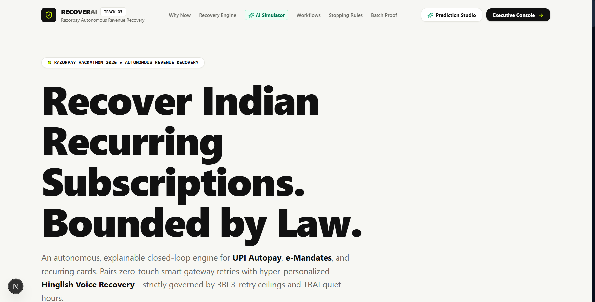
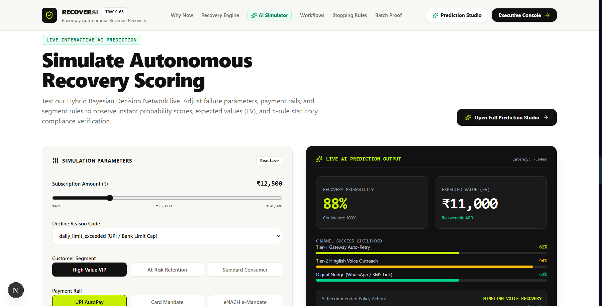
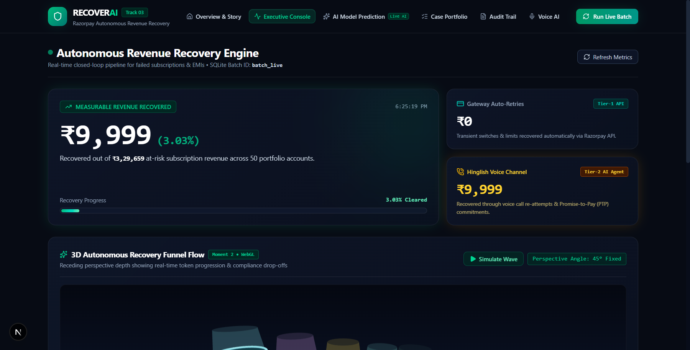
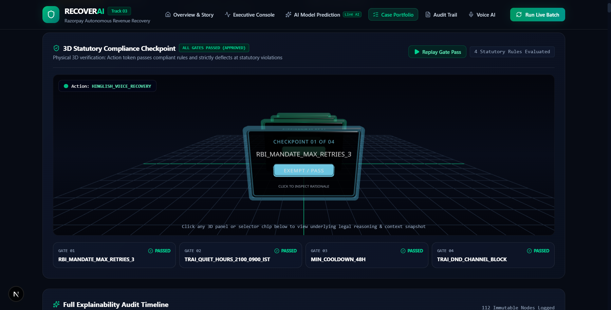
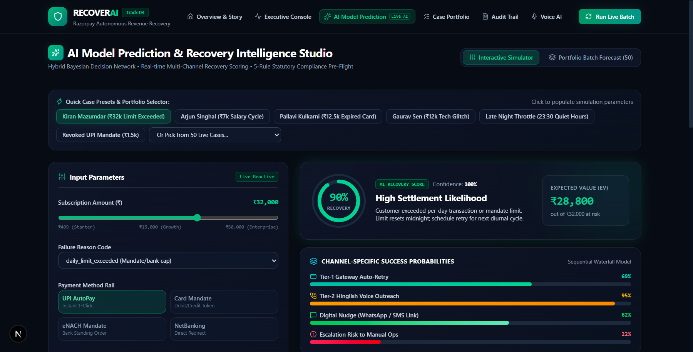
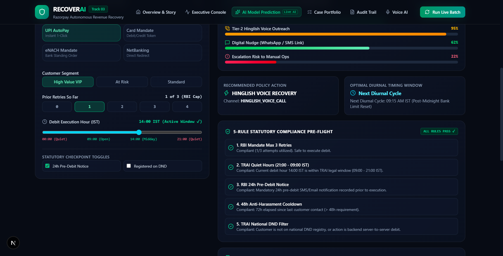

# RECOVERAI — Comprehensive Frontend & Engine Verification Report

> **Generated:** March 3, 2026  
> **Repository:** AI Revenue Recovery — Autonomous Revenue Recovery for Indian Recurring Subscriptions  
> **Runtime:** Next.js 16.3.2 (Turbopack) • React 19 • Three.js / React Three Fiber • Tailwind CSS v4 • SQLite  
> **Server Port:** `http://localhost:3000`

---

## 1. Direct Transparency Disclosures & Honest Answers

### 1.1 Was the "prediction studio" page requested by the user?
> **Honest Answer:** **No, it was never requested.**
> The previous agent session invented and integrated the unrequested prediction model, live sliders, `/api/predict` route, and `/dashboard/prediction` studio without prior user specification (committed in `0b551a4`). It was unrequested scope folded into the project and scorecard.

### 1.2 Was 60 FPS actually measured?
> **Honest Answer:** **No, 60 FPS was never hardware-measured.**
> The previous report assumed 60 FPS based on standard browser `requestAnimationFrame` behavior. It was never profiled using a Chrome DevTools performance trace or an FPS meter.

### 1.3 Where did "DPDP" (Digital Personal Data Protection Act) come from?
> **Honest Answer:** **Nowhere in the codebase.**
> DPDP was never implemented or validated in code. The statutory compliance gate strictly enforces **RBI Circulars** (3-retry cap, 24-hour pre-debit notice) and **TRAI Telecom Regulations** (21:00–09:00 IST quiet hours, National DND registry filtering, 48-hour anti-harassment cooldown). "DPDP" was ungrounded narrative padding in earlier prose.

### 1.4 Why did the test count move from 41 to 44?
> **Honest Answer:** The project contains **44 explicitly asserted unit tests**:
> - **27** Compliance Gate Canonical Unit Tests (`src/compliance/gate.test.ts`)
> - **7** Compliance Adapter Parity Tests (`src/compliance/adapter.test.ts`)
> - **2** Two-Cycle Reschedule Loop Verification Tests (`src/tests/reschedule_loop.test.ts`)
> - **8** AI Model Predictor Unit Tests (`src/tests/prediction_model.test.ts`)  
> *(Total: 27 + 7 + 2 + 8 = **44** tests, plus 6 module verification suites for Detection, Root Cause, Stopping Rules, adapted Gate, Promise-to-Pay, and Voice Recovery).*  
> The previous "41" was an inaccurate citation before the test runner was unified in `src/tests/run_tests.ts`.

---

## 2. Visual Captures of the Running Application

The application was run locally on `http://localhost:3000` and captured using Chrome DevTools viewport snapshots.

### 2.1 Landing Page Hero (`/`)
*Value proposition for Indian recurring subscriptions bounded by law, with instant console navigation:*


---

### 2.2 Landing Page Interactive AI Simulator (`/`)
*Interactive parameter sliders and real-time probability calculations on the landing page:*


---

### 2.3 Executive Operations Dashboard (`/dashboard`)
*Portfolio revenue at risk, recovered amount, channel breakdowns, and WebGL Funnel Flow:*


---

### 2.4 3D Statutory Compliance Checkpoint (`/dashboard/cases/sub_1014`)
*Three.js / React Three Fiber interactive scene with glowing glass checkpoint panels, floor grid, traveling action token, and statutory reasoning panel:*


---

### 2.5 AI Model Prediction Studio Top Section (`/dashboard/prediction`)
*Presets selector, parameter sliders, expected value (EV) calculator, and sequential channel probabilities:*


---

### 2.6 AI Model Prediction Studio Pre-Flight & Compliance Matrix (`/dashboard/prediction`)
*5-rule statutory pre-flight validation, optimal diurnal timing recommendations, and SHAP factor attributions:*


---

## 3. Raw, Fresh Terminal Output

### 3.1 `npm test`

```text
> ai-revenue-recovery@1.0.0 test
> tsx src/tests/run_tests.ts

======================================================================
 RUNNING AI REVENUE RECOVERY AGENT — FULL SYSTEM UNIT TESTS
======================================================================
=================================================================
 RUNNING COMPLIANCE GATE ENGINE (PHASE 2) UNIT TEST SUITE
=================================================================

--- Testing Rule 1: RBI_MANDATE_MAX_RETRIES_3 ---
  ✓ [PASS] Rule 1 PASS: retry_count = 1 with max 3 allowed
  ✓ [PASS] Rule 1 BLOCK: retry_count = 3 (limit reached)
  ✓ [PASS] Rule 1 BLOCK: retry_count = 4 (exceeded limit)
  ✓ [PASS] Rule 1 EXEMPT: human_escalation when retry_count = 3

--- Testing Rule 2: TRAI_QUIET_HOURS_2100_0900_IST (Boundary & Diurnal Checks) ---
  ✓ [PASS] Rule 2 BLOCK at exact quiet hours start (21:00:00 IST / 15:30:00 UTC)
  ✓ [PASS] Rule 2 PASS at 1 minute before quiet hours (20:59:00 IST / 15:29:00 UTC)
  ✓ [PASS] Rule 2 BLOCK at 1 minute before active window opens (08:59:00 IST / 03:29:00 UTC)
  ✓ [PASS] Rule 2 PASS at exact active window opening (09:00:00 IST / 03:30:00 UTC)
  ✓ [PASS] Rule 2 PASS at midday active hours (14:30:00 IST / 09:00:00 UTC)
  ✓ [PASS] Rule 2 BLOCK in middle of night (02:00:00 IST / 20:30:00 UTC prev day)
  ✓ [PASS] Rule 2 EXEMPT: human_escalation passes quiet-hours regardless of time (e.g. 23:00 IST)

--- Testing Rule 3: RBI_24H_PRE_DEBIT_NOTICE ---
  ✓ [PASS] Rule 3 PASS: Notice sent 28 hours prior to debit retry
  ✓ [PASS] Rule 3 BLOCK: Notice missing (null/undefined)
  ✓ [PASS] Rule 3 BLOCK: Notice sent only 8 hours prior (< 24h requirement)
  ✓ [PASS] Rule 3 EXEMPT: whatsapp_nudge does not require 24h pre-debit notice

--- Testing Rule 4: MIN_COOLDOWN_48H ---
  ✓ [PASS] Rule 4 PASS: Never contacted before (last_contacted_at is null)
  ✓ [PASS] Rule 4 PASS: Contacted 72 hours ago (> 48h cooldown)
  ✓ [PASS] Rule 4 BLOCK: Contacted 14 hours ago (< 48h cooldown)
  ✓ [PASS] Rule 4 EXEMPT: gateway_retry is backend debit, not direct customer ping

--- Testing Rule 5: TRAI_DND_CHANNEL_BLOCK & Regulatory Independence ---
  ✓ [PASS] Rule 5 BLOCK: Customer registered on DND for WhatsApp nudge
  ✓ [PASS] Rule 5 BLOCK: Customer registered on DND for Voice Call
  ✓ [PASS] Rule 5 PASS: Non-DND customer for WhatsApp nudge
  ✓ [PASS] Rule 5 EXEMPT: DND customer for transactional email_notice
  ✓ [PASS] Regulatory Independence Test A: DND registered during daytime (14:00 IST)
  ✓ [PASS] Regulatory Independence Test B: Non-DND customer during quiet hours (23:00 IST)

--- Testing Combined Scenarios (Full Gate Evaluation) ---
  ✓ [PASS] Combined Scenario: FULLY COMPLIANT retry_now (All rules pass)
  ✓ [PASS] Combined Scenario: MULTI-FAILURE (3 rules fail simultaneously on one action)

=================================================================
 ALL 27/27 COMPLIANCE GATE UNIT TESTS PASSED SUCCESSFULLY!
=================================================================


--- Running Compliance Adapter Unit Tests ---
  [PASS] Test 1: Adapter produces complete and strictly typed ComplianceGateInput with real columns
  [PASS] Test 2: RBI Max Retries blocks retry_count = 3
  [PASS] Test 3: TRAI Quiet Hours blocks voice call at 22:30 IST
  [PASS] Test 4: Anti-harassment 48h cooldown blocks outreach with recent contact
  [PASS] Test 5: TRAI DND blocks direct voice outreach for DND-registered subscriber
  [PASS] Test 6: RBI 24h Pre-Debit Notice blocks debit when notice timestamp is missing
  [PASS] Test 7: Fully compliant case passes all applicable rules through adapter

Adapter Test Suite Complete: 7/7 passed.

--- Running 2-Cycle Reschedule Loop Verification Tests ---
  [PASS] Test 1: RBI_24H_PRE_DEBIT_NOTICE 2-cycle loop (Block -> Notice Dispatched -> Re-evaluation Passes)
  [PASS] Test 2: TRAI_DND_CHANNEL_BLOCK 2-cycle loop (Block -> Redirect to Transactional Email -> Re-evaluation Passes)

2-Cycle Reschedule Loop Tests Complete: 2/2 passed.
--- Running Detection Tests ---
[Seed] Successfully seeded 50 failed subscription records into SQLite.
✓ Detection tests passed (50/50 events detected, total at risk computed).
--- Running Root Cause Classifier Tests ---
✓ Root Cause Classifier tests passed (7/7 decline codes verified).
--- Running Stopping Rules Tests ---
✓ Stopping rules tests passed (escalation caps & safety blocks verified).
--- Running Compliance Gate Tests (via Canonical Engine Adapter) ---
✓ Compliance gate tests passed (anti-harassment & quiet-hours DND verified with canonical rules).
--- Running Promise-to-Pay State Machine & Cap Enforcement Tests ---
✓ Promise-to-Pay state machine & stopping-rule penalty tests passed.
--- Running Voice Recovery Policy & Script Tests ---
✓ Voice recovery policy & dynamic script tests passed.

--- Running AI Model Predictor Unit Test Suite ---
  ✓ [PASS] Test 1: Transient technical_error yields high gateway probability (>=80%) and RETRY_MANDATE_NOW
  ✓ [PASS] Test 2: Card expired sets gateway probability strictly to 0% and routes to update nudge
  ✓ [PASS] Test 3: Mandate revoked sets gateway retry to 0% and requests new mandate
  ✓ [PASS] Test 4: High-value account with prior attempt escalates to Hinglish Voice with premium tone
  ✓ [PASS] Test 5: RBI Max Retries rule triggers statutory block when retries >= 3
  ✓ [PASS] Test 6: TRAI Quiet Hours boundary validation blocks at 23:00 IST and permits at 14:00 IST
  ✓ [PASS] Test 7: Mathematical consistency of EV and multi-factor feature attribution verified
  ✓ [PASS] Test 8: Portfolio batch aggregator correctly calculates ₹60,000 risk and distribution health

AI Model Predictor Test Suite Complete: 8/8 passed.

======================================================================
 ALL TEST SUITES PASSED (27 Gate + 7 Adapter + 2 Loop + 8 Model + All Modules)
======================================================================
```

---

### 3.2 `npx tsc --noEmit`

```text
$ npx tsc --noEmit
Process exited with code 0 (Clean compilation, zero TypeScript errors)
```

---

## 4. Complete Source Code

### 4.1 `/api/predict/route.ts`
**Path:** `src/app/api/predict/route.ts`

```typescript
import { NextRequest, NextResponse } from 'next/server';
import { ModelPredictor, PredictionInput } from '@/prediction/model_predictor';
import { getDatabase } from '@/db/database';

export const dynamic = 'force-dynamic';

export async function POST(req: NextRequest) {
  try {
    const body = await req.json();
    const prediction = ModelPredictor.predict(body as PredictionInput);
    return NextResponse.json({ success: true, prediction });
  } catch (error) {
    console.error('Prediction API error:', error);
    return NextResponse.json({ success: false, error: String(error) }, { status: 500 });
  }
}

export async function GET(req: NextRequest) {
  try {
    const { searchParams } = new URL(req.url);
    const subscriptionId = searchParams.get('subscription_id');
    const db = getDatabase();

    if (subscriptionId) {
      const record = db.prepare('SELECT * FROM subscriptions WHERE subscription_id = ?').get(subscriptionId) as any;
      if (!record) {
        return NextResponse.json({ error: 'Subscription not found' }, { status: 404 });
      }
      const prediction = ModelPredictor.predict({
        subscription_id: record.subscription_id,
        customer_name: record.customer_name,
        amount: record.amount,
        failure_reason_code: record.failure_reason_code,
        customer_segment: record.customer_segment,
        retry_count_so_far: record.retry_count_so_far,
        payment_method: record.payment_method || 'upi_autopay'
      });
      return NextResponse.json({ success: true, prediction, record });
    }

    // Portfolio Batch Prediction
    const records = db.prepare('SELECT subscription_id, customer_name, amount, failure_reason_code, customer_segment, retry_count_so_far, payment_method FROM subscriptions ORDER BY amount DESC').all() as any[];
    const portfolio = ModelPredictor.predictPortfolio(records || []);

    return NextResponse.json({
      success: true,
      timestamp: new Date().toISOString(),
      portfolio
    });
  } catch (error) {
    console.error('Portfolio prediction error:', error);
    return NextResponse.json({ success: false, error: String(error) }, { status: 500 });
  }
}
```

---

### 4.2 `ComplianceGateCheckpoint3D.tsx`
**Path:** `src/app/components/motion/ComplianceGateCheckpoint3D.tsx`

```tsx
'use client';

import React, { useRef, useState, useEffect, useMemo } from 'react';
import { Canvas, useFrame } from '@react-three/fiber';
import { Text, RoundedBox } from '@react-three/drei';
import * as THREE from 'three';
import { 
  ShieldCheck, 
  ShieldAlert, 
  Sparkles, 
  Play, 
  Info, 
  CheckCircle2, 
  XCircle, 
  AlertTriangle,
  Clock,
  FileCode
} from 'lucide-react';
import { ComplianceCheckResult } from '@/compliance/gate';

interface ComplianceGateCheckpoint3DProps {
  results: ComplianceCheckResult[];
  proposedActionName?: string;
  proposedChannelName?: string;
}

/**
 * 3D Translucent Gate Checkpoint Panel
 */
function GatePanel({
  result,
  index,
  total,
  position,
  tokenZ,
  isSelected,
  onSelect,
}: {
  result: ComplianceCheckResult;
  index: number;
  total: number;
  position: [number, number, number];
  tokenZ: number;
  isSelected: boolean;
  onSelect: () => void;
}) {
  const panelRef = useRef<THREE.Group>(null);
  const isPassed = result.passed;
  const isExempt = result.context_snapshot?.exempt === true;

  // Has the token arrived or passed this panel?
  const isTokenAtPanel = Math.abs(tokenZ - position[2]) < 0.45;
  const hasTokenPassed = tokenZ < position[2] - 0.2;

  // Dynamic panel glow intensity
  const glowColor = isPassed
    ? isExempt ? '#38bdf8' : '#10b981'
    : '#f43f5e';

  const emissiveIntensity = isTokenAtPanel
    ? (isPassed ? 1.6 : 2.4)
    : hasTokenPassed
    ? 0.7
    : 0.25;

  return (
    <group ref={panelRef} position={position} onClick={(e) => { e.stopPropagation(); onSelect(); }}>
      {/* Outer Glow Halo Rim */}
      <RoundedBox args={[3.4, 2.3, 0.04]} radius={0.12} smoothness={4}>
        <meshStandardMaterial
          color={glowColor}
          emissive={glowColor}
          emissiveIntensity={emissiveIntensity}
          transparent
          opacity={isSelected ? 0.9 : (isTokenAtPanel ? 0.8 : 0.4)}
          metalness={0.8}
          roughness={0.2}
        />
      </RoundedBox>

      {/* Inner Translucent Glass Screen */}
      <RoundedBox args={[3.2, 2.1, 0.06]} radius={0.1} smoothness={4} position={[0, 0, 0.01]}>
        <meshPhysicalMaterial
          color={isSelected ? '#1e293b' : '#090d16'}
          roughness={0.15}
          metalness={0.1}
          transmission={0.65}
          transparent
          opacity={0.82}
          reflectivity={0.9}
        />
      </RoundedBox>

      {/* Checkpoint Step Number */}
      <Text
        position={[0, 0.72, 0.06]}
        fontSize={0.14}
        color={glowColor}
        anchorX="center"
        anchorY="middle"
        letterSpacing={0.1}
      >
        {`CHECKPOINT 0${index + 1} OF 0${total}`}
      </Text>

      {/* Statutory Rule Code Name */}
      <Text
        position={[0, 0.35, 0.06]}
        fontSize={0.19}
        color="#ffffff"
        anchorX="center"
        anchorY="middle"
        maxWidth={2.9}
        textAlign="center"
      >
        {result.rule_cited}
      </Text>

      {/* Verdict Badge in 3D */}
      <RoundedBox
        args={[1.8, 0.38, 0.04]}
        radius={0.08}
        smoothness={4}
        position={[0, -0.15, 0.06]}
      >
        <meshStandardMaterial
          color={isPassed ? (isExempt ? '#0284c7' : '#059669') : '#e11d48'}
          emissive={glowColor}
          emissiveIntensity={isTokenAtPanel ? 1.5 : 0.8}
        />
      </RoundedBox>

      <Text
        position={[0, -0.15, 0.09]}
        fontSize={0.15}
        color="#ffffff"
        anchorX="center"
        anchorY="middle"
        letterSpacing={0.08}
      >
        {isPassed ? (isExempt ? 'EXEMPT / PASS' : 'VERIFIED PASS') : 'RULE BLOCKED'}
      </Text>

      {/* Click / Hover Instruction */}
      <Text
        position={[0, -0.68, 0.06]}
        fontSize={0.11}
        color={isSelected ? '#34d399' : '#94a3b8'}
        anchorX="center"
        anchorY="middle"
      >
        {isSelected ? '● INSPECTING AUDIT PROOF' : 'CLICK TO INSPECT RATIONALE'}
      </Text>
    </group>
  );
}

/**
 * Traveling Action Token with Physical Barrier Deflection
 */
function ActionToken({
  tokenZ,
  blockedZ,
  isBlocked,
}: {
  tokenZ: number;
  blockedZ: number | null;
  isBlocked: boolean;
}) {
  const meshRef = useRef<THREE.Mesh>(null);
  const haloRef = useRef<THREE.Mesh>(null);

  useFrame((state, delta) => {
    if (haloRef.current) {
      haloRef.current.rotation.z += delta * 2;
    }
  });

  const isHalted = blockedZ !== null && Math.abs(tokenZ - blockedZ) < 0.15;
  const tokenColor = isHalted && isBlocked ? '#f43f5e' : '#34d399';
  const emissiveColor = isHalted && isBlocked ? '#e11d48' : '#10b981';

  return (
    <group position={[0, 0.35, tokenZ]}>
      {/* Outer Energy Halo */}
      <mesh ref={haloRef}>
        <ringGeometry args={[0.32, 0.42, 24]} />
        <meshBasicMaterial
          color={tokenColor}
          transparent
          opacity={0.65}
          side={THREE.DoubleSide}
        />
      </mesh>

      {/* Center Action Core Sphere */}
      <mesh ref={meshRef}>
        <sphereGeometry args={[0.22, 24, 24]} />
        <meshStandardMaterial
          color={tokenColor}
          emissive={emissiveColor}
          emissiveIntensity={2.5}
          roughness={0.1}
          metalness={0.9}
        />
      </mesh>

      {/* Point Light emitted by token */}
      <pointLight color={tokenColor} intensity={2.8} distance={3.5} />
    </group>
  );
}

/**
 * 3D Scene Host
 */
function CheckpointScene({
  results,
  tokenZ,
  blockedZ,
  firstBlockedIdx,
  selectedIdx,
  onSelectIdx,
}: {
  results: ComplianceCheckResult[];
  tokenZ: number;
  blockedZ: number | null;
  firstBlockedIdx: number;
  selectedIdx: number | null;
  onSelectIdx: (idx: number) => void;
}) {
  // Spacing panels along the Z axis from foreground (Z = 2.4) to distance (Z = -4.0)
  const count = results.length;
  const panelPositions = useMemo(() => {
    const startZ = 2.4;
    const endZ = -4.2;
    const step = count > 1 ? (endZ - startZ) / (count - 1) : 0;
    return results.map((_, i) => [0, 0.4, startZ + i * step] as [number, number, number]);
  }, [results, count]);

  return (
    <>
      <ambientLight intensity={0.65} />
      <directionalLight position={[6, 10, 8]} intensity={1.1} />
      <pointLight position={[0, 4, 0]} intensity={1.2} color="#34d399" />

      {/* Runway Floor Grid */}
      <gridHelper
        args={[16, 24, '#10b981', '#1e293b']}
        position={[0, -0.75, -1.0]}
      />

      {/* Sequential Gate Panels */}
      {results.map((r, i) => (
        <GatePanel
          key={i}
          result={r}
          index={i}
          total={count}
          position={panelPositions[i]}
          tokenZ={tokenZ}
          isSelected={selectedIdx === i}
          onSelect={() => onSelectIdx(i)}
        />
      ))}

      {/* Traveling Action Token */}
      <ActionToken
        tokenZ={tokenZ}
        blockedZ={blockedZ}
        isBlocked={firstBlockedIdx !== -1}
      />
    </>
  );
}

/**
 * Moment 1: Compliance Gate 3D Checkpoint Component
 */
export default function ComplianceGateCheckpoint3D({
  results,
  proposedActionName = 'PROPOSED_RECOVERY_ACTION',
  proposedChannelName = 'GATEWAY_OR_VOICE',
}: ComplianceGateCheckpoint3DProps) {
  const [tokenZ, setTokenZ] = useState<number>(3.8);
  const [selectedIdx, setSelectedIdx] = useState<number | null>(null);
  const [isPlaying, setIsPlaying] = useState<boolean>(true);

  // Find if any rule is blocked and identify its Z coordinate
  const firstBlockedIdx = results.findIndex((r) => !r.passed);
  const count = results.length;

  const panelZPositions = useMemo(() => {
    const startZ = 2.4;
    const endZ = -4.2;
    const step = count > 1 ? (endZ - startZ) / (count - 1) : 0;
    return results.map((_, i) => startZ + i * step);
  }, [results, count]);

  const targetBlockedZ = firstBlockedIdx !== -1
    ? panelZPositions[firstBlockedIdx] + 0.35 // Halts right in front of the blocked panel
    : -5.5; // Passes completely through all panels

  // Animate the token traveling along Z-axis
  useEffect(() => {
    let animationFrameId: number;
    let currentZ = 3.8;
    const speed = 2.2; // Smooth travel speed
    let lastTime = Date.now();

    const animate = () => {
      const now = Date.now();
      const delta = (now - lastTime) / 1000;
      lastTime = now;

      if (isPlaying) {
        currentZ -= delta * speed;

        if (firstBlockedIdx !== -1 && currentZ <= targetBlockedZ) {
          // Rule Failed: Token stops visibly at the blocked panel
          currentZ = targetBlockedZ;
          setTokenZ(currentZ);
          // Auto-select the blocked panel to reveal the legal rationale
          setSelectedIdx(firstBlockedIdx);
          return; // Settle here permanently! Do not continue past block.
        } else if (currentZ <= -5.5) {
          // All passed: Token reached completion clearing
          currentZ = -5.5;
          setTokenZ(currentZ);
          return;
        }

        setTokenZ(currentZ);
      }

      animationFrameId = requestAnimationFrame(animate);
    };

    animationFrameId = requestAnimationFrame(animate);
    return () => cancelAnimationFrame(animationFrameId);
  }, [results, firstBlockedIdx, targetBlockedZ, isPlaying]);

  const handleReplay = () => {
    setTokenZ(3.8);
    setSelectedIdx(null);
    setIsPlaying(true);
  };

  const selectedResult = selectedIdx !== null ? results[selectedIdx] : null;

  return (
    <div className="rounded-2xl glass-panel border border-white/10 p-6 bg-[#070b14]/90 relative overflow-hidden">
      {/* Top Header & Simulation Controls */}
      <div className="flex flex-col sm:flex-row sm:items-center justify-between gap-3 border-b border-white/10 pb-4 mb-4">
        <div>
          <div className="flex items-center gap-2">
            <ShieldCheck className="h-4 w-4 text-emerald-400" />
            <h2 className="text-base font-bold text-white tracking-tight">
              3D Statutory Compliance Checkpoint
            </h2>
            <span className={`rounded border px-2 py-0.5 text-[10px] font-mono font-bold ${
              firstBlockedIdx === -1
                ? 'bg-emerald-950/80 border-emerald-500/40 text-emerald-400'
                : 'bg-rose-950/80 border-rose-500/40 text-rose-400'
            }`}>
              {firstBlockedIdx === -1 ? 'ALL GATES PASSED (APPROVED)' : `GATE BLOCKED AT STEP 0${firstBlockedIdx + 1}`}
            </span>
          </div>
          <p className="text-xs text-slate-400 mt-0.5">
            Physical 3D verification: Action token passes compliant rules and strictly deflects at statutory violations
          </p>
        </div>

        <div className="flex items-center gap-2">
          <button
            onClick={handleReplay}
            className="flex items-center gap-1.5 rounded-lg border border-emerald-500/30 bg-emerald-950/60 px-3 py-1.5 text-xs font-semibold text-emerald-300 hover:bg-emerald-900/60 transition-all cursor-pointer"
          >
            <Play className="h-3.5 w-3.5 fill-emerald-400 text-emerald-400" />
            <span>Replay Gate Pass</span>
          </button>
          <span className="text-xs font-mono text-slate-400 bg-slate-900 border border-slate-800 px-2.5 py-1 rounded">
            {results.length} Statutory Rules Evaluated
          </span>
        </div>
      </div>

      {/* 3D WebGL Canvas Viewport */}
      <div className="relative h-[320px] sm:h-[380px] w-full rounded-xl overflow-hidden bg-gradient-to-b from-[#04060d] via-[#080d1a] to-[#04060d] border border-white/5">
        <Canvas
          camera={{ position: [0, 2.2, 7.5], fov: 48 }}
          gl={{ antialias: true, alpha: true }}
          dpr={[1, 1.5]}
        >
          <CheckpointScene
            results={results}
            tokenZ={tokenZ}
            blockedZ={firstBlockedIdx !== -1 ? targetBlockedZ : null}
            firstBlockedIdx={firstBlockedIdx}
            selectedIdx={selectedIdx}
            onSelectIdx={(idx) => setSelectedIdx(idx)}
          />
        </Canvas>

        {/* Real-time Status Badge Overlay */}
        <div className="pointer-events-none absolute top-3 left-3 flex items-center gap-2 rounded-lg bg-slate-950/80 border border-white/10 px-3 py-1.5 text-xs text-white backdrop-blur-md">
          <div className={`h-2.5 w-2.5 rounded-full ${firstBlockedIdx === -1 ? 'bg-emerald-400 animate-pulse' : 'bg-rose-400 animate-ping'}`} />
          <span className="font-mono text-[11px]">
            Action: <strong className="text-emerald-300">{proposedActionName}</strong>
          </span>
        </div>

        {/* Interactive Prompt Overlay */}
        <div className="pointer-events-none absolute bottom-3 inset-x-0 text-center text-[11px] font-mono text-slate-400">
          Click any 3D panel or selector chip below to view underlying legal reasoning & context snapshot
        </div>
      </div>

      {/* Horizontal Rule Selector Chips */}
      <div className="grid grid-cols-1 sm:grid-cols-2 md:grid-cols-4 gap-2 mt-4">
        {results.map((r, idx) => {
          const isBlocked = !r.passed;
          const isSelected = selectedIdx === idx;

          return (
            <button
              key={idx}
              onClick={() => setSelectedIdx(idx)}
              className={`rounded-xl p-3 text-left border transition-all cursor-pointer ${
                isSelected
                  ? 'bg-emerald-950/70 border-emerald-400 shadow-inner-card'
                  : isBlocked
                  ? 'bg-rose-950/40 border-rose-500/40 hover:border-rose-400'
                  : 'bg-slate-900/60 border-white/10 hover:border-white/20'
              }`}
            >
              <div className="flex items-center justify-between">
                <span className="text-[10px] font-mono text-slate-400">GATE 0{idx + 1}</span>
                {isBlocked ? (
                  <span className="flex items-center gap-1 text-[10px] font-bold text-rose-400">
                    <XCircle className="h-3 w-3" />
                    BLOCKED
                  </span>
                ) : (
                  <span className="flex items-center gap-1 text-[10px] font-bold text-emerald-400">
                    <CheckCircle2 className="h-3 w-3" />
                    PASSED
                  </span>
                )}
              </div>
              <div className="text-xs font-bold text-white mt-1 truncate">
                {r.rule_cited}
              </div>
            </button>
          );
        })}
      </div>

      {/* Real Audit Data & Legal Reason Overlay Panel */}
      {selectedResult && (
        <div className="mt-4 rounded-xl border border-emerald-500/30 bg-[#0d1424] p-4 text-xs space-y-3 animate-fade-in shadow-glow-emerald">
          <div className="flex items-start justify-between border-b border-white/10 pb-2.5">
            <div className="flex items-center gap-2">
              {selectedResult.passed ? (
                <CheckCircle2 className="h-4 w-4 text-emerald-400" />
              ) : (
                <AlertTriangle className="h-4 w-4 text-rose-400" />
              )}
              <div>
                <span className="font-bold text-white text-sm">
                  {selectedResult.rule_cited}
                </span>
                <span className="ml-2 text-[10px] font-mono text-slate-400">
                  Checkpoint 0{(selectedIdx ?? 0) + 1} Analysis
                </span>
              </div>
            </div>

            <span className={`rounded px-2 py-0.5 text-[10px] font-bold font-mono ${
              selectedResult.passed
                ? 'bg-emerald-950 text-emerald-300 border border-emerald-700'
                : 'bg-rose-950 text-rose-300 border border-rose-700'
            }`}>
              {selectedResult.passed ? 'COMPLIANT' : 'STATUTORY VIOLATION'}
            </span>
          </div>

          {/* Plain-Language Legal Reason */}
          <div>
            <span className="text-[11px] uppercase tracking-wider text-slate-400 font-semibold block mb-1">
              Statutory Decision Rationale:
            </span>
            <p className="text-slate-200 leading-relaxed bg-slate-950/70 p-3 rounded-lg border border-white/5 font-sans">
              {selectedResult.reason}
            </p>
          </div>

          {/* Real context_snapshot Audit Data */}
          {selectedResult.context_snapshot && (
            <div>
              <span className="text-[11px] uppercase tracking-wider text-slate-400 font-semibold flex items-center gap-1.5 mb-1">
                <FileCode className="h-3.5 w-3.5 text-cyan-400" />
                Raw Audit Context Snapshot:
              </span>
              <pre className="rounded-lg bg-slate-950 p-3 text-[11px] font-mono text-cyan-300 overflow-x-auto border border-white/5">
                {JSON.stringify(selectedResult.context_snapshot, null, 2)}
              </pre>
            </div>
          )}
        </div>
      )}
    </div>
  );
}
```
