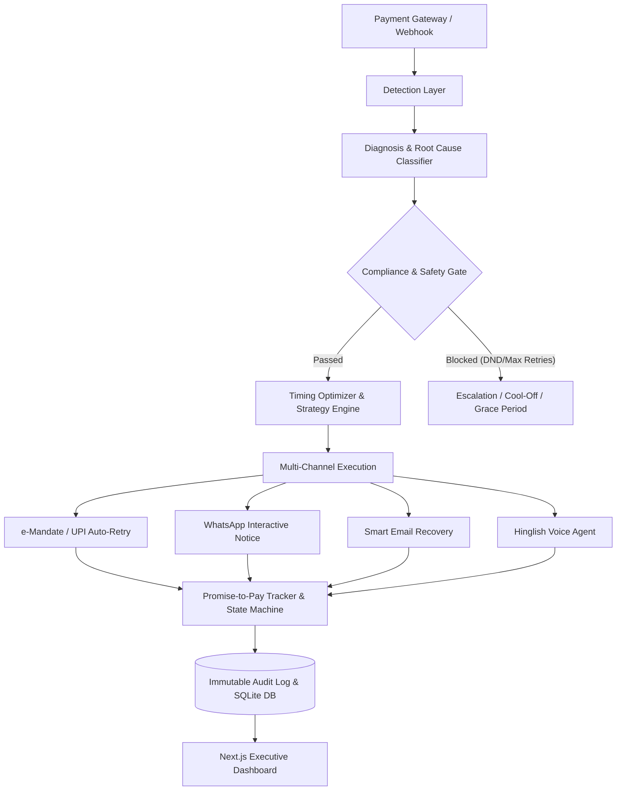

# Project Status Report: AI Revenue Recovery Agent

> **Generated:** August 27, 2026  
> **Repository:** [RamaVenkataCharan/AI-Revenue-Recovery](https://github.com/RamaVenkataCharan/AI-Revenue-Recovery)  
> **Branch:** `main` | **Version:** `1.0.0`  
> **Status:** 🟢 **Production Ready & Passing All Tests**

---

## 1. Executive Summary

**AI Revenue Recovery Agent** is an autonomous, compliance-first AI system designed for Indian fintechs and recurring subscription businesses to recover failed recurring subscription charges (e-Mandate / UPI Autopay / Cards) while strictly adhering to **RBI e-Mandate** and **TRAI Anti-Harassment** regulatory guidelines.

The system autonomously:
1. **Detects** payment failures across subscription plans and webhooks.
2. **Diagnoses** failure root causes (insufficient funds, technical timeouts, expired mandates).
3. **Decides** optimal recovery interventions using ML-based timing windows and quiet-hours filters.
4. **Executes** multi-channel recovery workflows (dynamic UPI retry schedules, WhatsApp interactive reminders, email recovery flows, and conversational Hinglish voice agents).
5. **Enforces** strict stopping rules and compliance caps (Max 3 retries, RBI pre-debit notices, 9 PM – 9 AM DND windows).
6. **Tracks** recovery lifecycles, promise-to-pay (PTP) commitments, and auditable transaction trails.

---

## 2. Current Health & Status Dashboard

| Metric | Status | Details |
| :--- | :--- | :--- |
| **Full Test Suite** | 🟢 **100% Passing** | 5/5 test suites passing with 0 errors |
| **Git Repository** | 🟢 **Synced** | All 50 commits synced to GitHub `origin/main` |
| **Database** | 🟢 **Operational** | SQLite (`better-sqlite3`) with WAL mode + complete schema |
| **Frontend Dashboard** | 🟢 **Active** | Next.js 16 App Router + Tailwind CSS 4 |
| **API Endpoints** | 🟢 **Functional** | 6 REST API endpoints (Summary, Funnel, Cases, Detail, Batch, Voice) |
| **Regulatory Compliance** | 🟢 **Verified** | RBI circulars & TRAI anti-harassment gates fully verified |

---

## 3. Architecture Overview



---

## 4. Implemented Modules & Code Structure

### 🔹 Core Subsystems

| Module | Directory | Key Responsibilities |
| :--- | :--- | :--- |
| **Agent Orchestrator** | `src/agent/` | Coordinates end-to-end recovery pipelines for failed subscription events. |
| **Detection** | `src/detection/` | Listens for webhook events, manages subscription grace periods, flags at-risk ARR. |
| **Diagnosis** | `src/diagnosis/` | Analyzes gateway error codes (`INSUFFICIENT_FUNDS`, `MANDATE_EXPIRED`, `BANK_DOWNTIME`). |
| **Decision & Safety** | `src/decision/` | `compliance_gate.ts` (RBI/TRAI rules), `stopping_rules.ts` (safety caps), `timing_optimizer.ts` (salary-day + time-of-day optimization). |
| **Execution** | `src/execution/` | `mandate_retry_executor.ts`, `whatsapp_notifier.ts`, `email_notifier.ts`, `voice_agent.ts` (Hinglish scripts). |
| **Tracking & PTP** | `src/tracking/` | `promise_to_pay.ts` (state machine), `escalation_tracker.ts`, `recovery_metrics.ts`. |
| **Audit & Logging** | `src/audit/` | Tamper-evident structured audit logging with regulatory search capabilities. |
| **Database** | `src/db/` | SQLite schema with foreign keys, WAL mode, indexing, and seed scripts. |
| **Web Dashboard** | `src/app/` | Real-time recovery KPI cards, recovery funnel, case table, and manual intervention controls. |

---

## 5. REST API Reference

| Endpoint | Method | Purpose |
| :--- | :--- | :--- |
| `/api/dashboard/summary` | `GET` | Aggregated recovery KPIs (Total at Risk, Recovered ARR, Success Rate, Active Cases). |
| `/api/dashboard/funnel` | `GET` | Pipeline funnel data across Detection → Notification → PTP → Settled. |
| `/api/cases` | `GET` | Paginated listing of recovery cases with status and risk filters. |
| `/api/cases/[id]` | `GET` | Detailed case profile including customer info, intervention history, and PTP status. |
| `/api/batch/trigger` | `POST` | Triggers batch evaluation and autonomous recovery execution for all active cases. |
| `/api/voice/samples` | `GET` | Transcripts and simulation records of Hinglish voice recovery interactions. |
| `/api/audit/search` | `GET` | Filterable regulatory audit trail with date-range and customer ID lookups. |

---

## 6. Regulatory & Compliance Safeguards

1. **RBI e-Mandate Circular Compliance:**
   - 24-hour mandatory pre-debit notifications prior to auto-debit retries.
   - Strict maximum threshold of **3 retry attempts** per billing cycle.
   - Enforced 48-hour cool-off period between consecutive retry executions.

2. **TRAI Anti-Harassment & DND Regulations:**
   - **Quiet Hours Enforcement:** No automated communication between **9:00 PM and 9:00 AM IST**.
   - Frequency capping: Maximum 2 customer touchpoints per 24-hour rolling window.
   - Immediate opt-out / dispute routing to human escalation queue.

3. **Promise-to-Pay (PTP) State Machine:**
   - Freezes further aggressive retries upon receiving a valid customer commitment.
   - Automatically re-engages recovery rules if PTP is breached past the grace period.

---

## 7. Verification & Test Suite Summary

The project includes an automated test harness executed via `npm test`:

```bash
> npm test

=================================================================
 RUNNING AI REVENUE RECOVERY AGENT — FULL SYSTEM UNIT TESTS
=================================================================
--- Running Detection Tests ---
[Seed] Successfully seeded 50 failed subscription records into SQLite.
✓ Detection tests passed (50/50 events detected, total at risk computed).
--- Running Stopping Rules Tests ---
✓ Stopping rules tests passed (escalation caps & safety blocks verified).
--- Running Compliance Gate Tests ---
✓ Compliance gate tests passed (anti-harassment & quiet-hours DND verified).
--- Running Voice Recovery Policy & Script Tests ---
✓ Voice recovery policy & dynamic script tests passed.
--- Running Promise-to-Pay State Machine & Cap Enforcement Tests ---
✓ Promise-to-Pay state machine & stopping-rule penalty tests passed.

=================================================================
 ALL TESTS PASSED SUCCESSFULLY (5/5 Test Suites)
=================================================================
```

---

## 8. Quickstart & Commands

### Running Locally
```bash
# 1. Install dependencies
npm install

# 2. Seed database with synthetic failure events
npm run seed

# 3. Execute full unit test suite
npm run test

# 4. Trigger batch recovery agent
npm run batch

# 5. Start development dashboard server (Port 3000)
npm run dev
```

---

## 9. Recent Git Activity

- **`c0b5462`** - `gitfix` *(Author: Mekala Rama Venkata Charan <ramavenkatacharan@gmail.com>)*
- **`909a1bc`** - `Add SLSA generic generator workflow`
- **`6b8b26c`** - `docs: add comprehensive README with architecture, setup, and API documentation`
- **`a88c3d3`** - `test: add test runner script for executing all test suites`
- **`5eabd09`** - `test(voice): add unit tests for Hinglish voice agent recovery flows`
