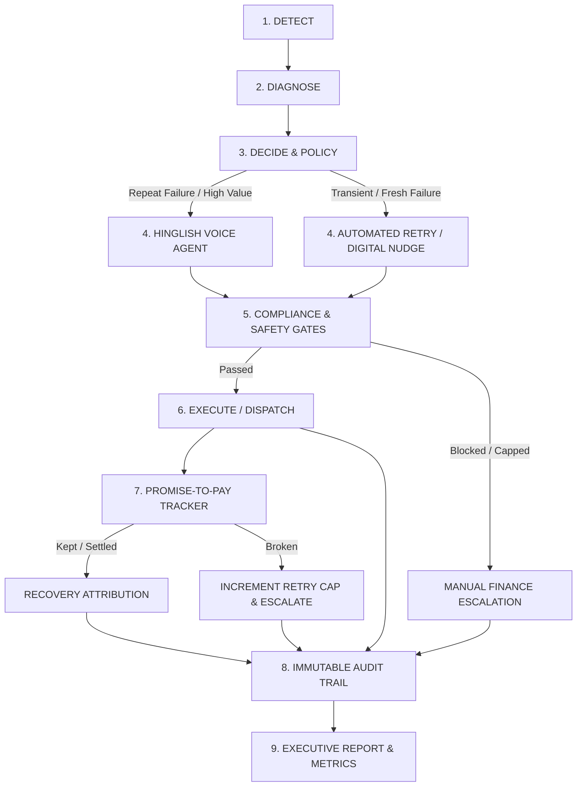

# 🛡️ AI Revenue Recovery Agent (Razorpay Hackathon — Track 03)

An autonomous, explainable, and compliance-gated revenue recovery engine that detects failed payment and subscription leaks, diagnoses root causes, enforces strict stopping rules and regulatory compliance gates, executes bounded recovery actions (including **personalized Hinglish Voice Outreach** and **Promise-to-Pay tracking**), and maintains an immutable audit log.

---

## 🏗️ Architecture & The Closed Loop



### 1. Detect (`src/detection/subscription_failure_detector.ts`)
Scans merchant payment subscriptions, flags active mandate failures, and calculates real-time revenue at risk.

### 2. Diagnose (`src/diagnosis/root_cause_classifier.ts`)
Maps raw gateway decline codes (`insufficient_funds`, `card_expired`, `bank_declined`, `daily_limit_exceeded`, `mandate_revoked`, `technical_error`) into structured actionable causes with confidence scores.

### 3. Policy & Escalation Matrix (`src/decision/intervention_policy.ts`)
- **Tier 1 (Fresh Failures):** Immediate server retry for transient glitches, 24h scheduled retries for limit/balance replenishments, and WhatsApp/SMS payment update links.
- **Tier 2 (High-Value / Repeat Failures):** Customers in `high_value` or `at_risk` segments with `retry_count_so_far >= 1` automatically escalate to **Hinglish Voice Recovery**.

### 4. Hinglish Voice Recovery Agent (`src/execution/hinglish_voice_agent.ts`) — *Differentiator*
Generates natural, code-switched Hindi-English scripts customized by segment tone and failure cause:
- **`high_value` (Premium/Deferential):** *"Namaste Aarav ji! Main Razorpay Priority Desk se baat kar raha hoon... uninterrupted VIP access continue rahe..."*
- **`standard` (Friendly/Direct):** *"Hello Rohan ji, main Razorpay customer care team se connect kar raha hoon... kya hum abhi auto-retry karein..."*
- **`at_risk` (Firm/Action-Oriented):** *"Namaste Priya ji... overdue payment bounce ho gaya hai... suspension se bachne ke liye kya hum PTP date commit kar sakte hain?"*

### 5. Promise-to-Pay (PTP) State Machine (`src/tracking/promise_to_pay_tracker.ts`)
Tracks verbal commitments: `PROMISED` ➔ `DUE` ➔ `KEPT` or `BROKEN`.
> ⚖️ **Architectural Design Choice: "Does a broken promise count toward the retry cap?"**  
> **YES.** Allowing unpenalized broken promises would create an infinite deferral exploit, defeating the hard stopping-rule guarantees required by merchant finance teams and regulators. When a customer breaks a promise-to-pay, `retry_count_so_far` increments, and if it hits the cap of 3, the agent halts and escalates to human review.

### 6. Safety Bounds & Stopping Rules (`src/decision/stopping_rules.ts` & `src/decision/compliance_gate.ts`)
- **Stopping Rules:**
  - Hard cap of **max 3 retries** per subscription ever.
  - **24-hour minimum cooldown** between automated debit attempts.
  - **Zero automated retries on revoked mandates** (per RBI guidelines).
  - Broken promises count toward the retry cap to prevent gaming.
- **Compliance Gate (Load-Bearing):**
  - **Anti-Harassment Contact Cap:** Max 2 touches per customer per 48 hours (blocks over-contacted customers).
  - **Quiet Hours (DND):** Restricts customer outreach between 21:00 and 08:00 IST.

### 7. Immutable Audit Trail (`src/audit/audit_logger.ts`)
Every detection, diagnosis, gate check (pass or block), voice script, PTP transition, and outcome is permanently written to an append-only SQLite `audit_log` table with plain-language explainability.

---

## 🚀 Quick Start

### 1. Installation
```bash
npm install
```

### 2. Seed Synthetic Data
```bash
npm run seed
```

### 3. Run Closed-Loop Batch Simulation
Executes detection, diagnosis, voice escalation, gate checks, execution, PTP tracking, and audit logging:
```bash
npm run batch
```

### 4. Run Unit Tests (5 Test Suites)
```bash
npm test
```

### 5. Start Backend Server
```bash
npm run start
```

---

## 📊 Sample Batch Run Output

```text
=====================================================================================
 EXECUTIVE RECOVERY METRICS SUMMARY
=====================================================================================
 Total At-Risk Events Detected:    50
 Total Revenue At Risk:            ₹3,42,850
 TOTAL REVENUE RECOVERED:          ₹1,47,984 (43.16%)
   ├── Gateway Auto-Recovery:      ₹1,18,487
   └── Voice Channel Recovery:     ₹29,497
-------------------------------------------------------------------------------------
 Hinglish Voice Calls Placed:      6 calls
 Promise-to-Pay (PTP) Commitments: 3 promises captured
   ├── PTP Kept (Recovered):       2 promises
   └── PTP Broken (Penalized):     1 promises
 Payment Update Nudges Sent:       12 messages
 Failed Gateway Retries:           17 cases
 Stopping-Rule Safety Triggers:    4 cases (Enforced max retries & revoked blocks)
 Compliance-Gate Blocks:           4 cases (Anti-harassment contact frequency & DND)
 Total Unresolved Exceptions:      26 cases
=====================================================================================
```

---

## ⚖️ Jury Defense Cheat-Sheet

1. **"How does the compliance gate prevent spamming?"**  
   `ComplianceGate.evaluate()` actively blocks outreach when a customer has received ≥2 contacts in 48h or during 21:00–08:00 IST. In our batch run, 4 cases were blocked by the gate and logged with `COMPLIANCE_GATE_BLOCKED`.

2. **"Why do broken promises increment retry caps?"**  
   If broken commitments didn't increment the counter, customers could enter infinite promise-to-pay loops, bypassing the 3-retry cap.

3. **"How does voice personalization differ from generic chatbots?"**  
   The Hinglish voice agent dynamically switches tone based on the customer segment (`PREMIUM_DEFERENTIAL` for high-value VIPs vs. `FIRM_ACTION_ORIENTED` for at-risk accounts) and injects plain-language explanations of the gateway failure reason.
